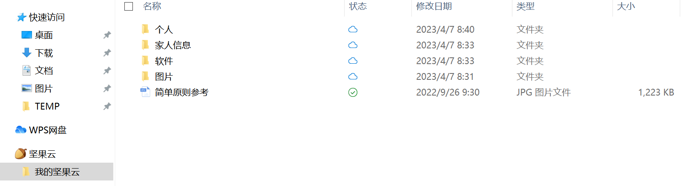
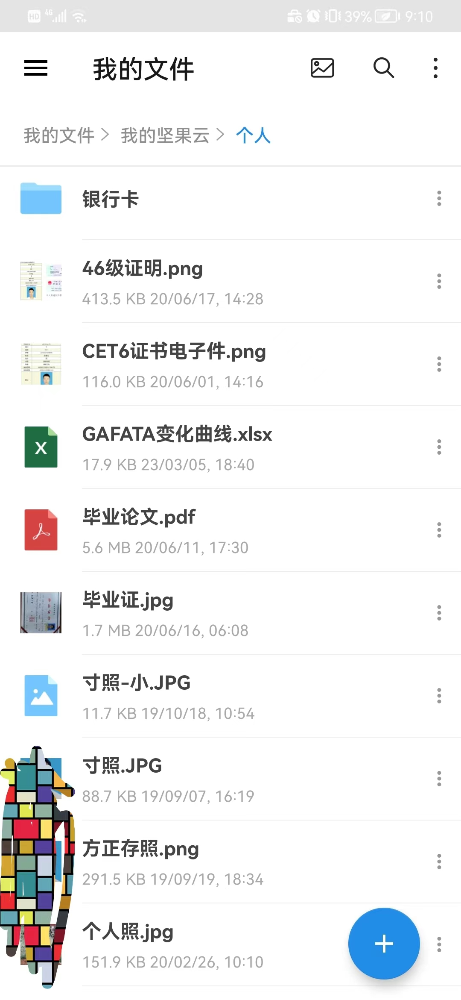
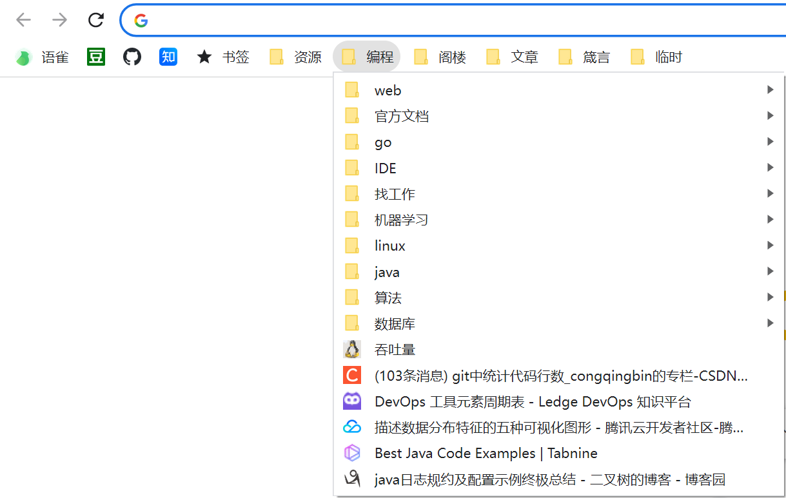

# initComputer

下面列出，我的装机必备软件。你可以参考之，更快捷搭出一个好用的办公环境。

## 装机必备

软件安装：

1. 下载[坚果云](https://www.jianguoyun.com/)，登录，安装 提前放入其中的 VPN 软件并激活。
   
   坚果云的一个巨大好处就是手机、电脑协同非常方便。实际上，我把我的个人身份证、简历、银行卡、毕业证等关键信息都会上传到坚果云。后续填写什么东西，需要这些东西时，不用满世界找。

   

2. 下载 google，登录账号。谷歌账号里有大量的收藏夹信息，历史记录信息。

   

3. 下载 idea（登录）、git、vscode（登录）、语雀（登录）、滴答清单（登录）、截屏工具[snipaste](https://zh.snipaste.com/)。

   其中 idea 从 2022 年左右的版本开始，账号管理维护做的更好了。下载的各类插件，也可以像是 vscode 一样上传到云端了。

   git 是看/写代码所必须。

然后就可以开始快乐的办公了。

## 推荐原则

除了上述装机必备的软件之外，我还推荐一些其他软件。

1. 此文档面向程序员。
2. 尽量使用开源软件。

## 工具推荐

1. 文本编辑器:[VSCode](https://code.visualstudio.com/)
   可以使用微软账号或 github 账号。内含 markdown 工具。
2. IDE: 无脑推荐 intellij 家的。不论你开发什么语言。当然如果你开发 matlab 就当我没说。
3. 截屏工具:[snipaste](https://zh.snipaste.com/)
4. Gif 录制工具:[ScreenToGif](https://www.screentogif.com/)
5. 压缩包工具:[7Z](https://www.7-zip.org/download.html)
